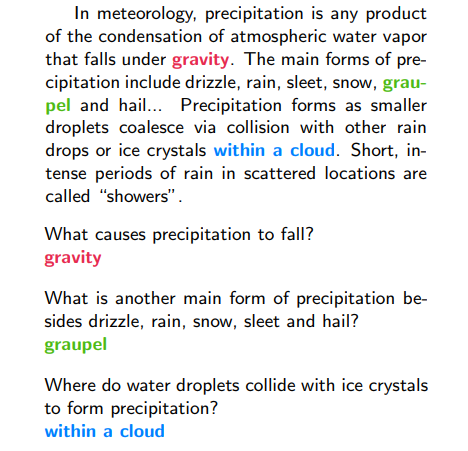
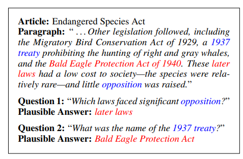

# 机器阅读理解

近年来随着阅读理解任务的流行，研究者们提出了各种各样的端到端深度学习机器阅读理解模型。
不像以前的从结构性知识决自动问答任务，RC(阅读理解)需要模型能够从给定的非结构性输入中提取信息。
与文本摘要任务不同，RC系统可以特定文本的目标问题，有效的提取文本中的观点与事实。

近年来RC相关的数据集层出不穷，适合深度学习的大型数据集也出现了一些。下面介绍一些比较流行的数据集。

## 常用数据集

### [CBT](https://arxiv.org/pdf/1610.00956.pdf)

Hill等人提出的完形填空风格数据集，每一段都是有20个完整句子，第21个句子缺失一个词，任务就是预测缺失的词。
训练数据总共包含37000个候选词，而每个空有10个相关联的选项。这些要填的空主要有四大类：常用名词，动词，介词命名实体，

### [CNN](https://arxiv.org/pdf/1506.03340.pdf)

CNN /Daily Mail数据集包含100万篇新闻文章，每篇都有与之相关几个重点句子。 他们也采用了
完形填空的方式准备数据集，他们从重点句子（问题）中删除一个实体（答案），它们匿名化使用实体，使模型只能依靠
文章中的信息来预测实体。平均一段文本需要从500个候选实体中选择26个实体完形填空。

### [bAbI](https://research.fb.com/downloads/babi/)

bAbI提供了20测试任务帮助研究者测试RC系统，CNN/DM 数据集有120000个单词，而BAbI限制到了150个词。
很多现代模型能够在这20任务中的大部分上达到100%的准确度。

### [SQuAD](https://rajpurkar.github.io/SQuAD-explorer/)

斯坦福问答数据集SQuAD1.1由100000多个问题组成，由维基百科段落，对应这个段落的提问和回答组成。

SQuAD2.0结合了SQuAD1.1中的100000个问题，以及众包工作者写的50,000多个新的无法回答的问题， 为了在SQuAD2.0上做得好，系统不仅要在可能的情况下回答问题，还要确定段落何时不支持回答并且不回答问题。 对于现有模型，SQuAD2.0是一项具有挑战性的自然语言理解任务，我们将SQuAD2.0作为SQuAD1.1的后续版本发布到社区。

不可回答问题如图

两个无法回答的问题，及其对应的错误答案

## 最新的模型

### [Key-Value Memory Networks](https://arxiv.org/pdf/1606.03126.pdf)

